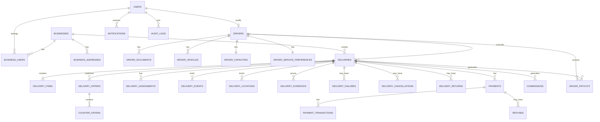

# 25 — ERD

## Modelo conceitual

## Observações

### `current_driver_id`

Se mantido em `deliveries`, é uma otimização de leitura. A fonte histórica continua sendo `delivery_assignments`. Alterações devem ocorrer na mesma transação.

### Origem e destino

A origem normalmente nasce do estabelecimento. O destino precisa ser um snapshot imutável da solicitação contratada.

### Geospatial

Avaliar MySQL Spatial para:
- localizar motoboys próximos;
- ordenar por distância;
- armazenar pontos de rastreamento;
- realizar consultas geográficas futuras.
